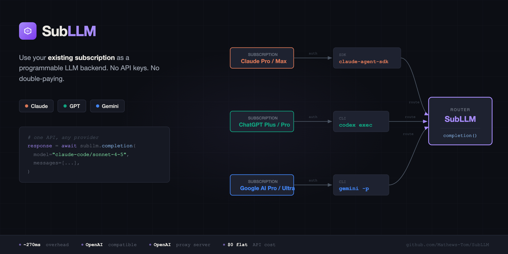

---

# SubLLM

> Route standard LLM API calls through subscription-authenticated coding agents instead of API keys.

Use your Claude Pro/Max, ChatGPT Plus/Pro, or Google AI Pro/Ultra subscription as the backend for programmatic LLM calls. SubLLM provides an **OpenAI-compatible unified interface** that abstracts Claude Code, Codex, and Gemini CLIs behind a standard `completion()` API.

## Why?

You already pay for a subscription — Claude Pro/Max, ChatGPT Plus/Pro, Google AI Pro/Ultra — but the moment you need to run a script, you're forced to pay _again_ for API access to the same models. Subscription plans offer flat-rate access but lock you into chat UIs with no programmatic interface. API keys unlock programmatic access but bill per-token on top of what you're already paying.

SubLLM eliminates the double-pay problem. It routes standard `completion()` calls through CLI tools that authenticate via your existing subscriptions — turning flat-rate chat plans into programmable LLM backends.

- **Flat-rate pricing** — pay your subscription, not per-token. Heavy usage costs the same as light usage.
- **Zero API key management** — CLIs authenticate through your subscription. No keys to provision, rotate, or secure.
- **OpenAI-compatible interface** — standard `completion()` API with OpenAI ChatCompletion response format. Swap SubLLM in/out of existing code with minimal changes.
- **Cross-provider** — same API surface for Claude, GPT, and Gemini. Switch models by changing a string.

| Approach                  | Cost (heavy usage) | Overhead   | Flexibility        |
| ------------------------- | ------------------ | ---------- | ------------------ |
| Direct API (per-token)    | $50-500+/mo        | ~0s        | Full control       |
| **SubLLM (subscription)** | **$0-200/mo flat** | **~280ms** | Good for batch/dev |
| Direct API + LiteLLM      | $50-500+/mo        | ~0s        | Multi-provider     |

**Best for:** development, prototyping, batch jobs, CI/CD, personal automation, cost-sensitive pipelines.

**Not for:** real-time chat UIs, latency-sensitive production services, multi-tenant SaaS (ToS constraints), workloads requiring tool use / function calling / prompt caching / logprobs / stop sequences (these features execute inside CLI sandboxes and are not exposed).

## Quick Start

### 1. Install

```bash
uv add subllm              # Core (includes Claude Agent SDK)
uv add subllm[server]      # + OpenAI-compatible proxy server
```

### 2. Authenticate Your CLIs

**Claude Code** (subscription auth):

```bash
curl -fsSL https://claude.ai/install.sh | bash
claude login
unset ANTHROPIC_API_KEY          # Force subscription auth
```

For headless/CI:

```bash
claude setup-token
export CLAUDE_CODE_OAUTH_TOKEN="your-token-here"
```

**Codex** (subscription auth):

```bash
npm install -g @openai/codex
codex login
```

**Gemini CLI** (free tier or subscription):

```bash
npm install -g @google/gemini-cli
gemini                           # Complete Google login
# Or use API key:
export GEMINI_API_KEY="your-key"
```

### 3. Use

**Python API:**

```python
import asyncio
import subllm

async def main():
    # Non-streaming
    response = await subllm.completion(
        model="claude-code/sonnet-4-5",
        messages=[{"role": "user", "content": "Explain monads in one sentence"}],
    )
    print(response.choices[0].message.content)

    # Streaming
    stream = await subllm.completion(
        model="gemini/gemini-3-flash-preview",
        messages=[{"role": "user", "content": "Write a haiku about Rust"}],
        stream=True,
    )
    async for chunk in stream:
        print(chunk.choices[0].delta.content, end="")

asyncio.run(main())
```

**CLI:**

```bash
subllm auth                                        # Check all providers
subllm models                                      # List available models
subllm complete "What is 2+2?" -m claude-code/sonnet-4-5
subllm complete "Write a haiku" -m gemini/gemini-3-flash-preview --stream
```

**OpenAI-compatible proxy:**

```bash
subllm serve --port 8080

# Then use ANY OpenAI-compatible client
from openai import OpenAI
client = OpenAI(base_url="http://localhost:8080/v1", api_key="unused")
response = client.chat.completions.create(
    model="claude-code/sonnet-4-5",
    messages=[{"role": "user", "content": "hello"}],
)
```

## Available Models

| Model ID                        | Backend                | Auth                              |
| ------------------------------- | ---------------------- | --------------------------------- |
| `claude-code/opus-4-6`          | Claude Opus 4.6        | Claude Max ($200)                 |
| `claude-code/sonnet-4-5`        | Claude Sonnet 4.5      | Claude Pro ($20) / Max ($100-200) |
| `claude-code/haiku-4-5`         | Claude Haiku 4.5       | Claude Pro ($20) / Max ($100-200) |
| `codex/gpt-5.2`                 | GPT-5.2                | ChatGPT Plus ($20) / Pro ($200)   |
| `codex/gpt-5.2-codex`           | GPT-5.2-Codex          | ChatGPT Plus ($20) / Pro ($200)   |
| `codex/gpt-4.1`                 | GPT-4.1                | ChatGPT Plus ($20) / Pro ($200)   |
| `codex/gpt-5-mini`              | GPT-5 Mini             | ChatGPT Plus ($20) / Pro ($200)   |
| `gemini/gemini-3-pro-preview`   | Gemini 3 Pro Preview   | API key / AI Pro / AI Ultra       |
| `gemini/gemini-3-flash-preview` | Gemini 3 Flash Preview | API key / AI Pro / AI Ultra       |

## Architecture

```plaintext
User Code ──→ subllm.completion() ──→ Router
                                       ├── ClaudeCodeProvider
                                       │     └── claude-agent-sdk (persistent client)
                                       ├── CodexProvider
                                       │     └── codex exec (subprocess)
                                       └── GeminiCLIProvider
                                             └── gemini -p (subprocess)
```

All providers delegate auth entirely to the underlying CLIs. SubLLM never stores or manages tokens directly. Multi-turn conversations use stateless message replay — the full conversation history is sent each turn.

## Batch Processing

```python
results = await subllm.batch([
    {"model": "claude-code/sonnet-4-5", "messages": [...]},
    {"model": "gemini/gemini-3-flash-preview", "messages": [...]},
    {"model": "codex/gpt-5.2", "messages": [...]},
], concurrency=5)
```

Runs completions in parallel with a concurrency semaphore. Each provider's CLI handles its own rate limiting internally.

## Benchmarks

Measured on macOS. Claude Code uses the Agent SDK (persistent client, no subprocess). Codex and Gemini use CLI subprocess (spawn, auth, inference, response parsing). Single run — expect variance across sessions.

### Auth Check

| Provider    | Method               | Latency |
| ----------- | -------------------- | ------- |
| claude-code | `claude auth status` | ~302ms  |
| codex       | subscription check   | ~94ms   |
| gemini      | OAuth credential file | ~2ms   |
| **all (parallel)** | **`asyncio.gather`** | **~279ms** |

Auth is bounded by the slowest provider. Previous sequential approach with inference roundtrips: ~30s total.

### Completion

| Provider    | Model                         | Non-streaming | Streaming |
| ----------- | ----------------------------- | ------------- | --------- |
| claude-code | `sonnet-4-5`                  | ~6s           | ~7s       |
| codex       | `gpt-5.2`                     | ~7s           | ~9s       |
| gemini      | `gemini-3-flash-preview`      | ~14s          | ~11s      |

### Multi-turn

| Provider    | Model                         | Turn 1 | Turn 2 |
| ----------- | ----------------------------- | ------ | ------ |
| claude-code | `sonnet-4-5`                  | ~8s    | ~3s    |
| codex       | `gpt-5.2`                     | ~9s    | ~10s   |
| gemini      | `gemini-3-flash-preview`      | ~55s   | ~12s   |

Full conversation history replayed each turn (stateless). Turn 2 carries Turn 1 context. Gemini Turn 1 includes initial codebase investigation overhead.

### Cross-provider Handoff

Message history replayed across different providers within a single conversation:

| Turn           | Provider                        | Latency |
| -------------- | ------------------------------- | ------- |
| 1 (remember)   | `claude-code/sonnet-4-5`        | ~7s     |
| 2 (recall)     | `codex/gpt-5.2`                | ~11s    |
| 3 (verify)     | `gemini/gemini-3-flash-preview` | ~15s    |

### Batch (3 parallel completions)

| Scope          | Latency |
| -------------- | ------- |
| claude-code    | ~8s     |
| codex          | ~10s    |
| gemini         | ~10s    |
| cross-provider | ~8s     |

Parallel execution bounded by the slowest request.

## Terms of Service & Disclaimer

SubLLM routes completion calls through CLI tools that authenticate via your subscription. It does not circumvent authentication, store credentials, or proxy third-party access. **Users are responsible for compliance with each provider's terms of service.**

- **Anthropic** — Anthropic prohibits third-party developers from offering claude.ai login for their products. The "user brings their own authenticated CLI" pattern is established by Cline, Zed, and Repo Prompt. Safe for personal and team use. Do not ship as a SaaS product.
- **OpenAI** — Codex CLI explicitly supports ChatGPT subscription auth and programmatic `exec` mode. Officially supported pattern.
- **Google** — Gemini CLI supports Google OAuth and API key auth. Standard usage pattern.

Review each provider's current ToS before use. Terms change.

## License

MIT
