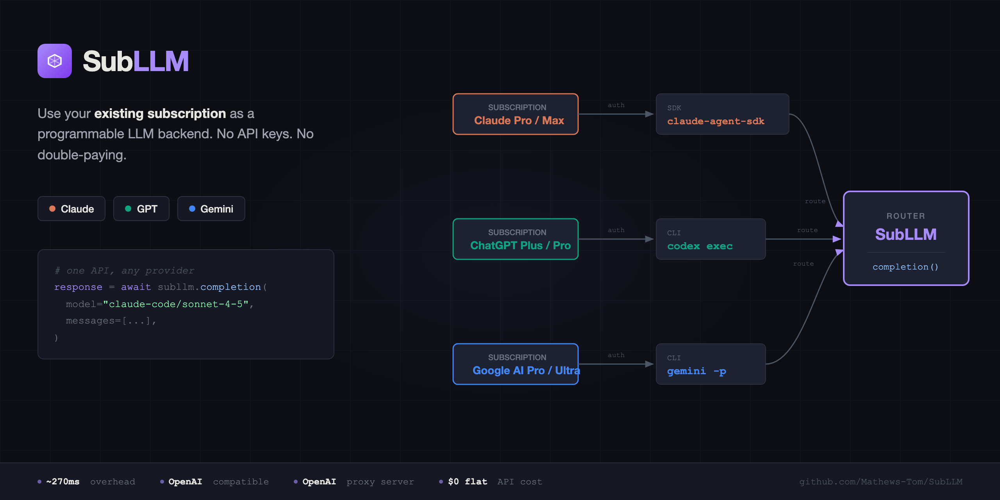

---

# SubLLM

> Experimental personal-use gateway for evaluating CLI-backed LLM access behind a narrow OpenAI-compatible subset.

SubLLM is an experimental package for personal use and small internal evaluation. It exposes a strict, limited OpenAI-compatible surface over Claude Code, Codex, and Gemini CLI backends. It is not positioned as a production proxy, resale layer, or a way to evade provider billing or platform terms.

## Why?

The project exists to explore whether a narrow, typed gateway can safely reuse provider-supported local CLI workflows for personal automation and evaluation. It is intentionally conservative about the contract, explicit about unsupported features, and designed around local operator control rather than broad deployment.

Use it only where the underlying provider tooling and your account terms permit it.

- **Experimental by design** — the supported surface is intentionally small and explicit.
- **Personal-use orientation** — suitable for local scripts, prototypes, and internal evaluation.
- **Fail-fast boundaries** — unsupported fields and unsupported provider capabilities are rejected explicitly.
- **OpenAI-compatible interface** — standard `completion()` API with OpenAI ChatCompletion response format. Swap SubLLM in/out of existing code with minimal changes.
- **Cross-provider** — same API surface for Claude, GPT, and Gemini. Switch models by changing a string.

| Approach                  | Cost (heavy usage) | Overhead   | Flexibility        |
| ------------------------- | ------------------ | ---------- | ------------------ |
| Direct API (per-token)    | $50-500+/mo        | ~0s        | Full control       |
| **SubLLM (subscription)** | **$0-200/mo flat** | **~280ms** | Good for batch/dev |
| Direct API + LiteLLM      | $50-500+/mo        | ~0s        | Multi-provider     |

**Best for:** development, prototyping, batch jobs, CI/CD, personal automation, and internal evaluation.

**Not for:** real-time chat UIs, latency-sensitive production services, multi-tenant SaaS, shared hosted access to consumer accounts, or any use that would violate provider terms. It also does not expose tool use / function calling / prompt caching / logprobs / stop sequences.

## Quick Start

### 1. Install

```bash
uv add subllm              # Core (includes Claude Agent SDK)
uv add subllm[server]      # + OpenAI-compatible proxy server
```

### 2. Authenticate Your CLIs

**Claude Code** (subscription auth):

```bash
curl -fsSL https://claude.ai/install.sh | bash
claude login
unset ANTHROPIC_API_KEY          # Force subscription auth
```

For headless/CI:

```bash
claude setup-token
export CLAUDE_CODE_OAUTH_TOKEN="your-token-here"
```

**Codex** (subscription auth):

```bash
npm install -g @openai/codex
codex login
```

**Gemini CLI** (free tier or subscription):

```bash
npm install -g @google/gemini-cli
gemini                           # Complete Google login
# Or use API key:
export GEMINI_API_KEY="your-key"
```

### 3. Use

**Python API:**

```python
import asyncio
import subllm

async def main():
    # Non-streaming
    response = await subllm.completion(
        model="claude-code/sonnet-4-5",
        messages=[{"role": "user", "content": "Explain monads in one sentence"}],
    )
    print(response.choices[0].message.content)

    # Streaming
    stream = await subllm.completion(
        model="gemini/gemini-3-flash-preview",
        messages=[{"role": "user", "content": "Write a haiku about Rust"}],
        stream=True,
    )
    async for chunk in stream:
        print(chunk.choices[0].delta.content, end="")

asyncio.run(main())
```

**CLI:**

```bash
subllm auth                                        # Check all providers
subllm models                                      # List available models
subllm complete "What is 2+2?" -m claude-code/sonnet-4-5
subllm complete "Write a haiku" -m gemini/gemini-3-flash-preview --stream
```

**OpenAI-compatible proxy:**

```bash
subllm serve --port 8080

# Then use ANY OpenAI-compatible client
from openai import OpenAI
client = OpenAI(base_url="http://localhost:8080/v1", api_key="unused")
response = client.chat.completions.create(
    model="claude-code/sonnet-4-5",
    messages=[{"role": "user", "content": "hello"}],
)
```

<!-- BEGIN GENERATED SECTION: registry-docs -->
## Supported Chat Completions Subset

SubLLM implements a strict subset of the OpenAI chat completions contract.

- Accepted request fields: `max_tokens`, `messages`, `model`, `prompt`, `session`, `stream`, `system_prompt`, `temperature`
- Supported message roles: `system`, `user`, `assistant`
- Message content supports plain strings or arrays of `text`, `image_url`, and `input_file` parts
- Supported endpoints: `POST /v1/chat/completions`, `GET /v1/models`, `GET /health`
- Explicit session mode is opt-in through the `session` field. Stateless requests do not reuse prior provider conversation state.
- Registered prompt references are accepted through the `prompt` field and resolve to versioned system prompt text before provider dispatch.
- Unsupported chat-completions fields are rejected explicitly. Common examples: `tools`, `tool_choice`, `parallel_tool_calls`, `response_format`, `logprobs`, `top_logprobs`, `n`, `metadata`, `modalities`, `audio`, `store`, `user`, `reasoning`

## Available Models

| Model ID | Backend | Auth |
| --- | --- | --- |
| `claude-code/opus-4-6` | Claude Opus 4.6 via `claude-agent-sdk` | Claude Max ($200) or Anthropic API key |
| `claude-code/sonnet-4-5` | Claude Sonnet 4.5 via `claude-agent-sdk` | Claude Pro ($20) / Max ($100-200) or Anthropic API key |
| `claude-code/haiku-4-5` | Claude Haiku 4.5 via `claude-agent-sdk` | Claude Pro ($20) / Max ($100-200) or Anthropic API key |
| `codex/gpt-5.2` | GPT-5.2 via `codex exec` | ChatGPT Plus ($20) / Pro ($200) or OPENAI_API_KEY |
| `codex/gpt-5.2-codex` | GPT-5.2-Codex via `codex exec` | ChatGPT Plus ($20) / Pro ($200) or OPENAI_API_KEY |
| `codex/gpt-4.1` | GPT-4.1 via `codex exec` | ChatGPT Plus ($20) / Pro ($200) or OPENAI_API_KEY |
| `codex/gpt-5-mini` | GPT-5 Mini via `codex exec` | ChatGPT Plus ($20) / Pro ($200) or OPENAI_API_KEY |
| `gemini/gemini-3-pro-preview` | Gemini 3 Pro Preview via `gemini -p` | GEMINI_API_KEY, GOOGLE_API_KEY, Google AI Pro, or Google AI Ultra |
| `gemini/gemini-3-flash-preview` | Gemini 3 Flash Preview via `gemini -p` | GEMINI_API_KEY, GOOGLE_API_KEY, Google AI Pro, or Google AI Ultra |

## Prompt Registry

| Prompt | Version | Variables | Description |
| --- | --- | --- | --- |
| `chat-default` | `v1` | none | General-purpose assistant baseline for deterministic replies. |
| `code-review` | `v1` | none | Review-focused system prompt for findings-first output. |
| `release-notes` | `v1` | `audience` | Release-summary prompt with an audience variable. |

## Provider Capabilities

| Provider | Streaming | Sessions | System Prompt | Vision | File Inputs | Context Window | Auth Modes | Backend |
| --- | --- | --- | --- | --- | --- | --- | --- | --- |
| claude-code | yes | yes | yes | no | yes | 200,000 | subscription, api_key | `claude-agent-sdk` |
| codex | yes | yes | yes | yes | yes | 200,000 | subscription, api_key | `codex exec` |
| gemini | yes | no | yes | no | yes | 1,000,000 | subscription, api_key | `gemini -p` |
<!-- END GENERATED SECTION: registry-docs -->

## Architecture

```plaintext
User Code ──→ subllm.completion() ──→ Router
                                       ├── ClaudeCodeProvider
                                       │     └── claude-agent-sdk (persistent client)
                                       ├── CodexProvider
                                       │     └── codex exec (subprocess)
                                       └── GeminiCLIProvider
                                             └── gemini -p (subprocess)
```

All providers delegate auth entirely to the underlying CLIs. SubLLM never stores or manages tokens directly. Multi-turn conversations use stateless message replay — the full conversation history is sent each turn.

## Batch Processing

```python
results = await subllm.batch([
    {"model": "claude-code/sonnet-4-5", "messages": [...]},
    {"model": "gemini/gemini-3-flash-preview", "messages": [...]},
    {"model": "codex/gpt-5.2", "messages": [...]},
], concurrency=5)
```

Runs completions in parallel with a concurrency semaphore. Each provider's CLI handles its own rate limiting internally.

## Benchmarks

Measured on macOS. Claude Code uses the Agent SDK (persistent client, no subprocess). Codex and Gemini use CLI subprocess (spawn, auth, inference, response parsing). Single run — expect variance across sessions.

### Auth Check

| Provider           | Method                | Latency    |
| ------------------ | --------------------- | ---------- |
| claude-code        | `claude auth status`  | ~302ms     |
| codex              | subscription check    | ~94ms      |
| gemini             | OAuth credential file | ~2ms       |
| **all (parallel)** | **`asyncio.gather`**  | **~279ms** |

Auth is bounded by the slowest provider. Previous sequential approach with inference roundtrips: ~30s total.

### Completion

| Provider    | Model                    | Non-streaming | Streaming |
| ----------- | ------------------------ | ------------- | --------- |
| claude-code | `sonnet-4-5`             | ~6s           | ~7s       |
| codex       | `gpt-5.2`                | ~7s           | ~9s       |
| gemini      | `gemini-3-flash-preview` | ~14s          | ~11s      |

### Multi-turn

| Provider    | Model                    | Turn 1 | Turn 2 |
| ----------- | ------------------------ | ------ | ------ |
| claude-code | `sonnet-4-5`             | ~8s    | ~3s    |
| codex       | `gpt-5.2`                | ~9s    | ~10s   |
| gemini      | `gemini-3-flash-preview` | ~55s   | ~12s   |

Full conversation history replayed each turn (stateless). Turn 2 carries Turn 1 context. Gemini Turn 1 includes initial codebase investigation overhead.

### Cross-provider Handoff

Message history replayed across different providers within a single conversation:

| Turn         | Provider                        | Latency |
| ------------ | ------------------------------- | ------- |
| 1 (remember) | `claude-code/sonnet-4-5`        | ~7s     |
| 2 (recall)   | `codex/gpt-5.2`                 | ~11s    |
| 3 (verify)   | `gemini/gemini-3-flash-preview` | ~15s    |

### Batch (3 parallel completions)

| Scope          | Latency |
| -------------- | ------- |
| claude-code    | ~8s     |
| codex          | ~10s    |
| gemini         | ~10s    |
| cross-provider | ~8s     |

Parallel execution bounded by the slowest request.

## Safety & Terms

SubLLM routes completion calls through locally installed provider CLIs or SDKs. It does not bypass authentication, crack access controls, or grant third parties access to your accounts. **Users are responsible for ensuring their usage complies with each provider's current terms and product policies.**

- Treat this package as experimental software for personal use and small internal evaluation.
- Do not present it as a mechanism to avoid provider pricing, bypass provider restrictions, or resell subscription-backed access.
- Do not deploy it as a public gateway or multi-tenant service over consumer accounts.
- Review each provider's current terms before use. Terms and product behavior change.

Provider-specific notes:

- **Anthropic** — avoid exposing Claude account-backed access through third-party hosted products or shared gateways.
- **OpenAI** — use only documented Codex CLI flows that your account and plan permit.
- **Google** — use only documented Gemini CLI or API-key flows that your account and plan permit.

## License

MIT
