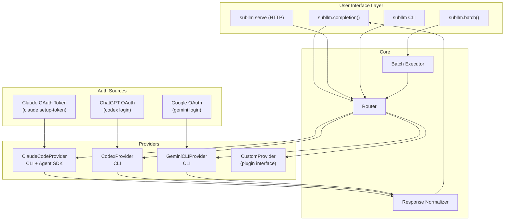
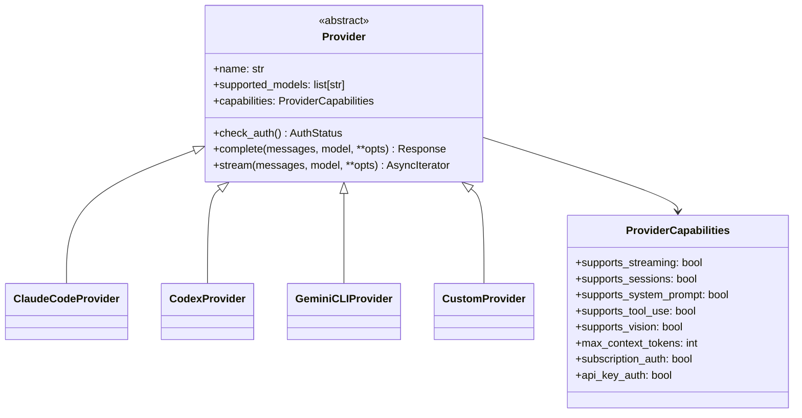

# SubLLM — Architecture & Design

> Subscription-Routed LLM Proxy: Route standard LLM API calls through consumer subscription-authenticated coding agents (Claude Code, Codex, Gemini CLI) instead of API keys.

## Problem Statement

Consumer subscriptions (Claude Pro/Max $20-200/mo, ChatGPT Plus/Pro $20-200/mo, Google AI Pro/Ultra) offer significantly better cost economics for many workloads compared to per-token API billing. Claude Code, OpenAI Codex, and Gemini CLI all support programmatic/headless execution authenticated via subscription OAuth — but there's no **unified, LiteLLM-style interface** that abstracts these backends behind a standard `completion()` call.

## Architecture



## How It Works

### Claude Code Path

Two programmatic modes, both compatible with subscription auth:

| Mode | Mechanism | Streaming | Cold Start | Auth |
|------|-----------|-----------|------------|------|
| `claude --print` | CLI subprocess, stdout capture | stream-json JSONL | ~600ms | OAuth from keychain or `CLAUDE_CODE_OAUTH_TOKEN` |
| `claude-agent-sdk` | Python SDK wrapping CLI | AsyncIterator | ~600ms first, warm after | Same — falls back to subscription if no `ANTHROPIC_API_KEY` |

**Key insight**: The Agent SDK shells out to Claude Code CLI under the hood. If `ANTHROPIC_API_KEY` is unset and Claude Code is authenticated via subscription (`claude login`), it uses OAuth automatically.

### Codex Path

| Mode | Mechanism | Streaming | Cold Start | Auth |
|------|-----------|-----------|------------|------|
| `codex exec` | CLI subprocess (Rust binary) | JSONL stdout | ~55ms | ChatGPT OAuth from `codex login` |

**Key insight**: Codex is a Rust binary — 10x faster cold start than Node.js-based CLIs. `codex exec` runs non-interactively and streams results to stdout.

### Gemini CLI Path

| Mode | Mechanism | Streaming | Cold Start | Auth |
|------|-----------|-----------|------------|------|
| `gemini -p` | CLI subprocess, headless mode | stream-json JSONL | ~200-400ms | Google OAuth (cached) or `GEMINI_API_KEY` |

**Key insight**: Gemini CLI provides the cleanest headless mode — `--output-format json` returns structured output with actual token stats. Free tier (60 req/min, 1000 req/day) makes it uniquely useful for cost-sensitive batch work. However, session resume is NOT supported in headless `-p` mode.

## Provider Capabilities

Each provider declares what it supports. The router adapts behavior accordingly.

| Capability | Claude Code | Codex | Gemini CLI |
|------------|-------------|-------|------------|
| Streaming | ✅ stream-json | ✅ JSONL | ✅ stream-json |
| Session resume (headless) | ⚠️ `--resume <id>` (buggy) | ✅ `--resume <id>` | ❌ Not in `-p` mode |
| System prompt | ✅ `--system-prompt` | ✅ Config | ✅ Via prompt |
| Vision/multimodal | ✅ File-based | ❌ | ✅ File-based |
| Max context | 200K tokens | 200K tokens | 1M tokens |
| Subscription auth | ✅ | ✅ | ✅ |
| API key auth | ✅ `ANTHROPIC_API_KEY` | ✅ `OPENAI_API_KEY` | ✅ `GEMINI_API_KEY` |
| Free tier | ❌ | ❌ | ✅ 60 req/min |

## ToS Considerations

| Provider | Official Position | Risk Level |
|----------|------------------|------------|
| **Anthropic** | *"Unless previously approved, Anthropic does not allow third party developers to offer claude.ai login or rate limits for their products."* | **Medium-High** for redistribution. **Low** for personal/internal use. Cline, Zed, Repo Prompt already use this path. |
| **OpenAI** | Codex CLI and SDK explicitly support ChatGPT subscription auth. `codex exec` designed for automation. | **Low** — officially supported |
| **Google** | Gemini CLI supports Google OAuth subscription auth natively. Free tier available. | **Low** — explicitly supported |

**Recommendation**: Build for personal/team use. Don't ship as a SaaS that sells access to subscription-backed models.

## API Design

### Model Naming Convention

```
<provider>/<model-alias>

claude-code/sonnet       → Claude Sonnet 4.5 via Claude Code CLI
claude-code/opus         → Claude Opus 4.5 via Claude Code CLI
claude-code/haiku        → Claude Haiku 4.5 via Claude Code CLI
codex/gpt-5.3           → GPT-5.3-Codex via Codex CLI
codex/gpt-5.3-spark     → GPT-5.3-Codex-Spark via Codex CLI
gemini/2.5-pro           → Gemini 2.5 Pro via Gemini CLI
gemini/2.5-flash         → Gemini 2.5 Flash via Gemini CLI
gemini/flash             → Gemini 2.5 Flash (alias)
gemini/pro               → Gemini 2.5 Pro (alias)
```

### Component Design



## Multi-Turn Conversations

SubLLM uses **stateless message replay** — the full conversation history is flattened into each prompt. This is universally supported across all providers and correct for conversations under ~10 turns.

```python
# Turn 1: User asks "What is X?" → CLI gets: "What is X?"
# Turn 2: User asks "Tell me more" → CLI gets:
#   "[Previous conversation]
#    User: What is X?
#    Assistant: X is... (previous response)
#    [Current request]
#    User: Tell me more about the second point."
```

Native session resume (Claude Code `--resume`, Codex `--resume`) is available as a future optimization but currently has reliability issues.

## Latency Profile

| Component | Claude Code | Codex | Gemini CLI |
|-----------|-------------|-------|------------|
| CLI cold start | ~600ms | ~55ms | ~200-400ms |
| Auth handshake | ~100-500ms | ~50-100ms | ~100-300ms |
| Model inference (TTFT) | 500ms-3s | 500ms-2s | 300ms-1.5s |
| **Total cold path** | **~1.5-4.5s** | **~0.7-2.2s** | **~0.7-2.3s** |

The dominant latency is model inference TTFT, which is identical whether calling via CLI or direct API. Actual SubLLM overhead is ~0.1-0.6s beyond that.

## Roadmap

### Phase 1: Foundation ✅
- [x] Claude Code CLI provider (subprocess + Agent SDK)
- [x] Codex CLI provider (subprocess)
- [x] Gemini CLI provider (subprocess)
- [x] OpenAI-compatible response format
- [x] Streaming support (all providers)
- [x] Auth status checking
- [x] CLI tool (`subllm auth/models/complete/serve`)
- [x] Provider capabilities declaration
- [x] Client-side batch execution
- [x] FastAPI OpenAI-compatible proxy server

### Phase 2: Optimization
- [ ] Claude Agent SDK warm-process integration
- [ ] Response cache (SQLite-based, opt-in)
- [ ] Vision/multimodal support (base64 → temp file → CLI)
- [ ] Token usage estimation improvements

### Phase 3: Ecosystem
- [ ] Process pool for warm CLI instances
- [ ] Hybrid session management (native + replay fallback)
- [ ] LiteLLM custom provider plugin
- [ ] Provider plugin system (`subllm.register_provider()`)

### Phase 4: Integrations
- [ ] Langchain `ChatSubLLM` wrapper
- [ ] LlamaIndex integration
- [ ] Multi-provider fallback chains
- [ ] Usage tracking dashboard
- [ ] Codex Python SDK integration (when available)
